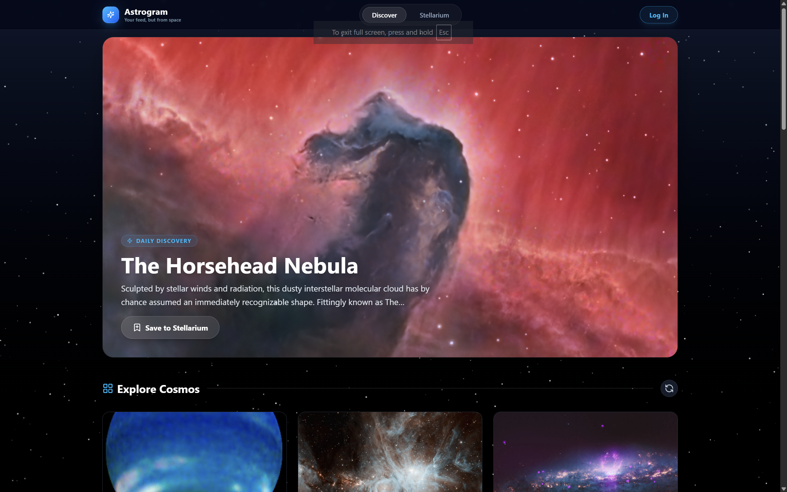

# 🌌 Astrogram

> **Your feed, but from space.**

A beautiful, responsive web‑app that serves the latest and greatest NASA Astronomy Picture of the Day (APOD) in an Instagram‑style masonry layout.
Create an account, save favourite cosmic shots to your personal **Stellarium**, and manage everything from a sleek settings panel.

---

## Presentation



## 🎥 Project Videos
- [Astrogram Demo](https://tinyurl.com/Astrogram-Demo)
- [Astrogram Code](https://tinyurl.com/Astrogram-Code)

## 📄 Project Report
- [Project Report (Click Here)](https://tinyurl.com/Astrogram-Report)

---

## ✨ Features

* 🚀 Daily hero APOD + infinite “Explore” feed
* 🔖 One‑click **Save to Stellarium** (synced to your account)
* 🌃 Real‑time animated star‑field background (Canvas)
* 🔐 JWT‑less auth (username/password + JSON‑Bin or json‑server)
* 🧑‍🚀 User profiles with auto‑generated avatars (DiceBear)
* 🗑️ Danger‑zone account deletion
* 🌙 Dark‑mode‑first UI (Tailwind + glass‑morphism)
* ⚡ React Router v6, lazy loading & optimistic UI
* 📱 Fully responsive (mobile → 4K)

---

## 🛠️ Tech Stack

| Layer      | Tech                               |
| ---------- | ---------------------------------- |
| UI         | React 18 + Vite + Tailwind CSS 3   |
| Routing    | React Router v6                    |
| HTTP       | Axios                              |
| Auth & DB  | json-server (or any REST endpoint) |
| Icons      | React Icons (Lucide)               |
| Animations | Framer Motion + CSS                |
| Background | HTML5 Canvas (star-field)          |
| Env        | Node 18+                           |

---

## 🚀 Quick Start

### 1. Clone & Install

```bash
git clone https://github.com/your-username/astrogram.git
cd astrogram
npm install
```

### 2. Environment Variables

Create a `.env` in the root:

```env
VITE_NASA_API_KEY=YOUR_NASA_API_KEY
VITE_API_URL=http://localhost:3000
VITE_API_URL=http://localhost:3000
```

### 3. Run JSON‑Server (fake backend)

```bash
npm run server
# or:
# json-server --watch ./server/db.json --port 3000
```

Schema:

```json
{
  "users": [
    {
      "id": "uuid",
      "name": "Display Name",
      "username": "unique",
      "password": "plain-text (demo only)",
      "avatar": "https://api.dicebear.com/7.x/notionists/svg?seed=name",
      "stellarium": []
    }
  ]
}
```

### 4. Start Dev Server

```bash
npm run dev
```

Open **[http://localhost:5173](http://localhost:5173)** 🚀

---

## 📁 Project Structure

```
src/
├─ components/
│  ├─ Navbar.jsx
│  ├─ Hero.jsx
│  ├─ Card.jsx
│  ├─ SavedCard.jsx
│  ├─ Loader.jsx
│  ├─ Starfield.jsx
│  └─ Toaster.jsx
├─ pages/
│  ├─ Discover.jsx
│  ├─ Stellarium.jsx
│  ├─ Login.jsx
│  ├─ Settings.jsx
│  └─ NotFound.jsx
├─ App.jsx
├─ main.jsx
└─ index.css
```

---

## 🔌 API Routes Used

| Method | Endpoint           | Purpose                     |
| ------ | ------------------ | --------------------------- |
| GET    | `/users?username=` | Login                       |
| POST   | `/users`           | Register                    |
| GET    | `/users/:id`       | Get profile + stellarium    |
| PUT    | `/users/:id`       | Update profile              |
| PATCH  | `/users/:id`       | Add/remove stellarium items |
| DELETE | `/users/:id`       | Delete account              |

---

## 🧪 Testing (planned)

```bash
npm run test        # Jest + RTL
npm run test:e2e    # Cypress
```

---

## 🚢 Build & Deploy

```bash
npm run build
npm run preview
```

Deploy `/dist` to Vercel, Netlify, GitHub Pages, or an Nginx server.

---

## 📝 Notes & Good Practices

* NASA images are public domain; videos embedded via YouTube/Vimeo.
* Auth is demo‑grade (plain passwords). Replace with a real backend for production.
* Star‑field canvas may be heavy on 4K; throttle resize events.
* Tailwind uses CDN; enable purging in production.

---

## 🤝 Contributing

PRs welcome!

1. Fork repo
2. `git checkout -b feature/amazing-thing`
3. Commit with clear messages
4. Open PR

---

## 📄 License

This project is licensed under the **GNU General Public License v3.0 (GPLv3)**.

Made with ☕ + 🌌 by **123JUICE-BOY321**
